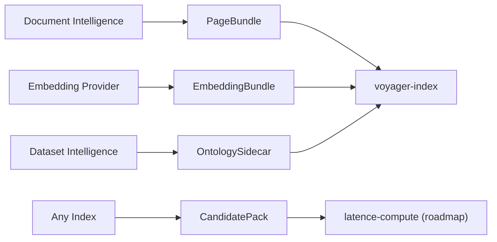

# Adapter Contracts

This document defines the first-pass cross-stream seams around
`voyager-index`.

It is intentionally documentation-first. These contracts are not yet versioned
wire formats or enforced schemas across every repo, but they name the intended
stable handoff points between OSS, commercial adjacencies, and future compute
productization.

## Contract Rules

- keep stable IDs as the primary join key across streams
- prefer additive evolution over breaking field renames
- keep provenance metadata so downstream systems know where a record came from
- keep proprietary producers outside the OSS package; the OSS package should
  consume these contracts, not embed the upstream services themselves

## Contract Map

## PageBundle

Producer:
- document intelligence systems such as `superpod/services/doc_intel_v2/`
- local `voyager-index` preprocessing via `voyager_index.render_documents(...)`
  or `POST /reference/preprocess/documents`

Consumer:
- `voyager-index` multimodal and hybrid ingestion flows

Required fields:
- `bundle_version`
- `doc_id`
- `pages`

Required page fields:
- `page_id`
- `page_number`
- one of `image_uri` or `image_path`

Common optional fields:
- `source_uri`
- `markdown`
- `text`
- `width`
- `height`
- `token_count`
- `metadata`

Purpose:
- keep page-native multimodal assets external to the OSS package
- let markdown or text flow into optional BM25 or enrichment lanes without
  forcing document intelligence into the index runtime
- allow the OSS reference surface to own the source-doc to page-image stage when
  users only have local PDF, DOCX, XLSX, or image inputs

## EmbeddingBundle

Producer:
- `vllm-factory` or another embedding provider

Consumer:
- `voyager-index`

Required fields:
- `bundle_version`
- `model_id`
- `modality`
- `dim`
- `items`

Required item fields:
- `target_id`
- `shape`
- one of `vectors`, `vector_path`, or another agreed tensor reference

Common optional fields:
- `pooling_task`
- `provider`
- `provider_metadata`
- `page_id`
- `chunk_id`
- `doc_id`

Purpose:
- separate provider/runtime concerns from index concerns
- keep the public OSS provider seam centered on
  `SUPPORTED_MULTIMODAL_MODELS` and `VllmPoolingProvider`

## OntologySidecar

Producer:
- dataset intelligence systems such as `latenceai-dataset-intelligence/`

Consumer:
- `voyager-index`

Required fields:
- `bundle_version`
- `target_kind`
- `targets`

Required target fields:
- `target_id`

Common optional fields:
- `entities`
- `relations`
- `concepts`
- `scores`
- `constraints`
- `metadata`

Purpose:
- keep ontology and graph generation outside the OSS package
- allow retrieval to consume structurally aligned sidecars without hidden
  dependencies on a proprietary pipeline

## CandidatePack

Producer:
- `voyager-index` or any external index

Consumer:
- future `latence-compute`

Required fields:
- `bundle_version`
- `query_id`
- `candidates`

Required candidate fields:
- `candidate_id`
- `branch`
- `token_cost`

Common optional fields:
- `approx_score`
- `exact_score`
- `normalized_score`
- `embedding_ref`
- `cluster_id`
- `ontology_features`
- `rhetorical_role`
- `metadata`
- `provenance`

Purpose:
- make compute productization index-agnostic
- preserve branch provenance and score context when multiple candidate lanes are
  merged before optimization

## Current Status

- `PageBundle`, `EmbeddingBundle`, `OntologySidecar`, and `CandidatePack` are
  named and documented here
- they are not yet fully standardized as versioned schemas across every repo
- future code work should evolve these contracts deliberately rather than
  introducing hidden one-off couplings
